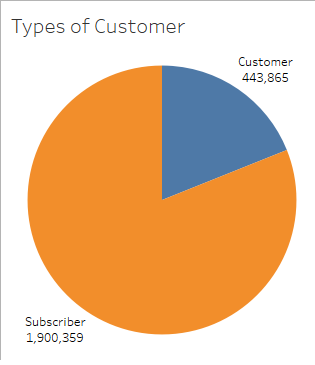
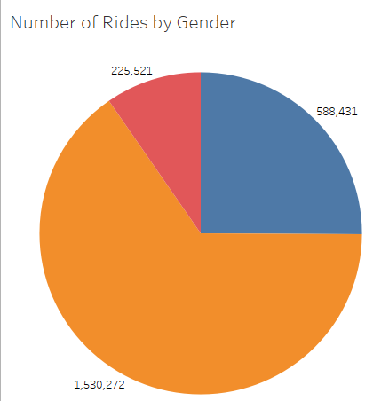
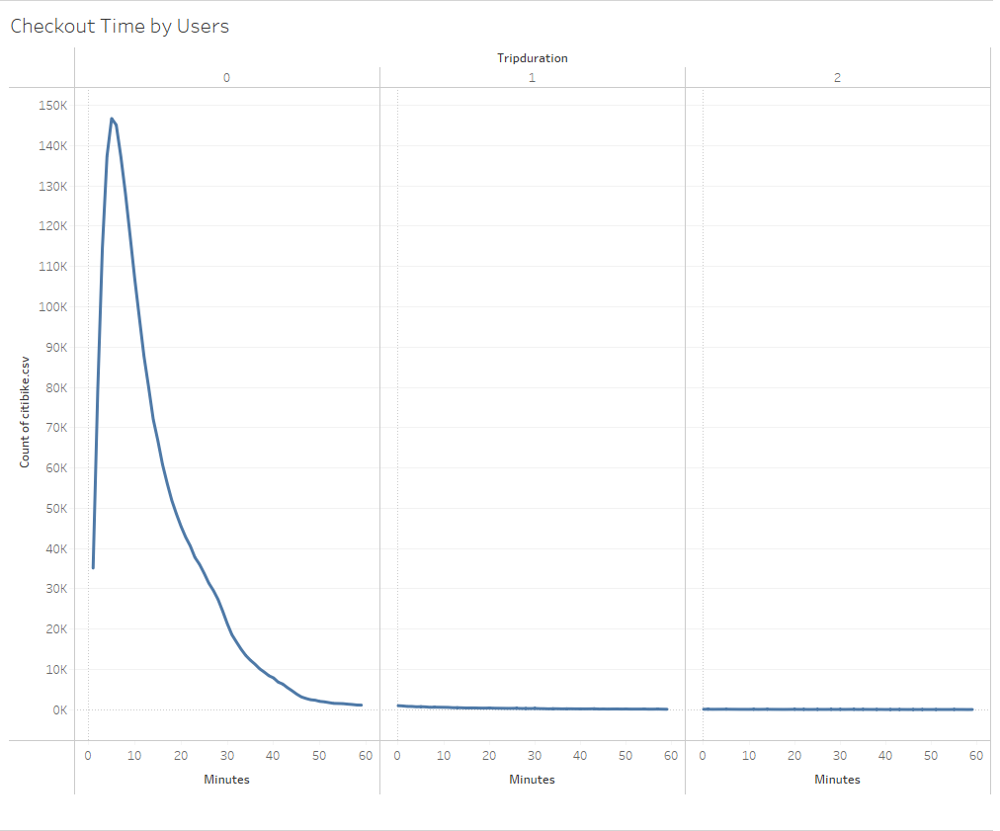
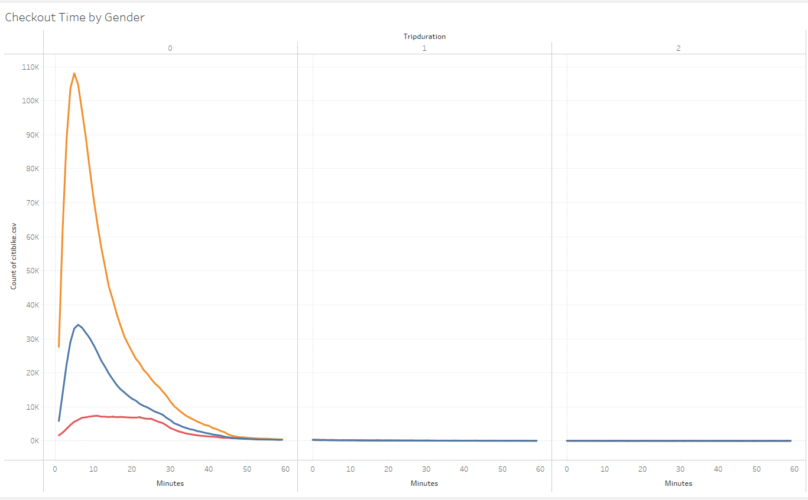
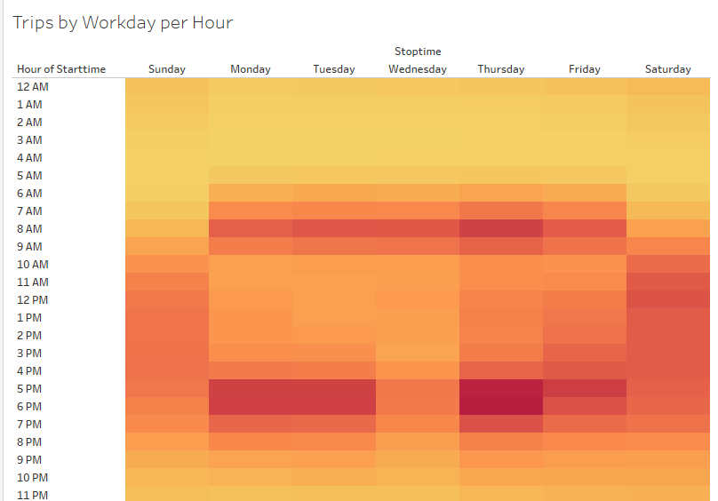
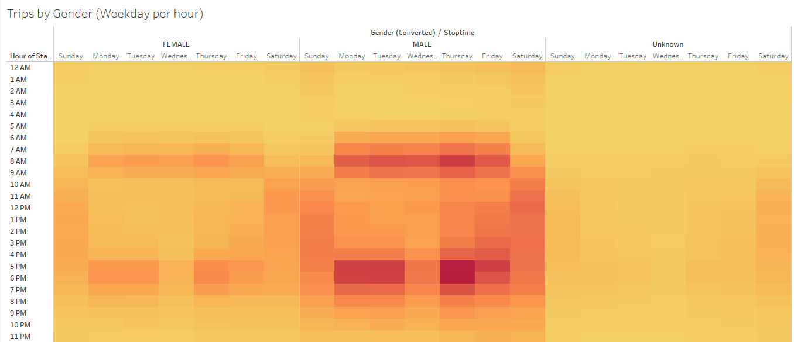
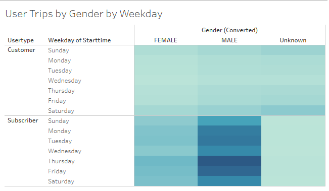

# Bikesharing
## Overview of the project
The objective of this project is to make a business proposal for a bike sharing app in Des Moines, Iowa using NYC Citi Bike dataset as a starting point to determine based on a statistical analysis if it's a good idea to undertake this project. 

The project was uploaded to [Tableau](https://public.tableau.com/profile/manuel8857#!/vizhome/NYCCitiBikeAnalysis_16179293820200/NYCBikes). In this link you can view the different graphs used for this analysis.

## Overview of the statistical analysis:

For this project we had to answer several questions like: 
- How many customers use this service?
- How many customers are long term subscribers of this service and how many are short term? 

 - Based on the previous Graph we can see that, 433,865 customers are short term users and 1,900,359 are subscribers.
 

- Of all the customers 1,530,272 are male, 588,431 are female and 225,521 are unknown. 

- We also wanted to determine for how many mintues do customers use the bike for. In the following graph we can see that around 140,000 users use the bikes for approximately 5 minutes.

- We've also included a Checkout graph by gender, as we can see on most men spend 5 minutes on their trips, females also spend 5 and unknown spend 10 :

- Trips by gender graph during Weekday shows that the busiest hours are during 7:00 am - 8:00am and 5:00pm, 6:00pm and 7:00pm. The reason may be that this are starting and ending office hours and most people use Citi Bikes as a form of transportation.  

-We did the same graph but filtering by gender, as we can see the pattern is repeated across al genders. 

- This part of the analysis can also help us determine when to do maintenance, according to this graphs, maintenance should be donde during 1:00 am and 2:00am

##Results:

